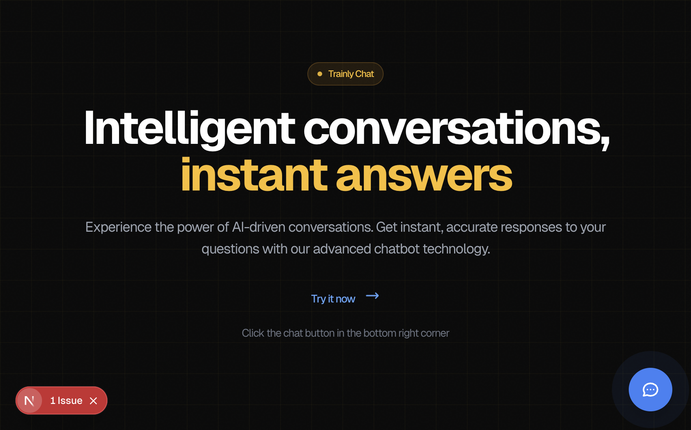
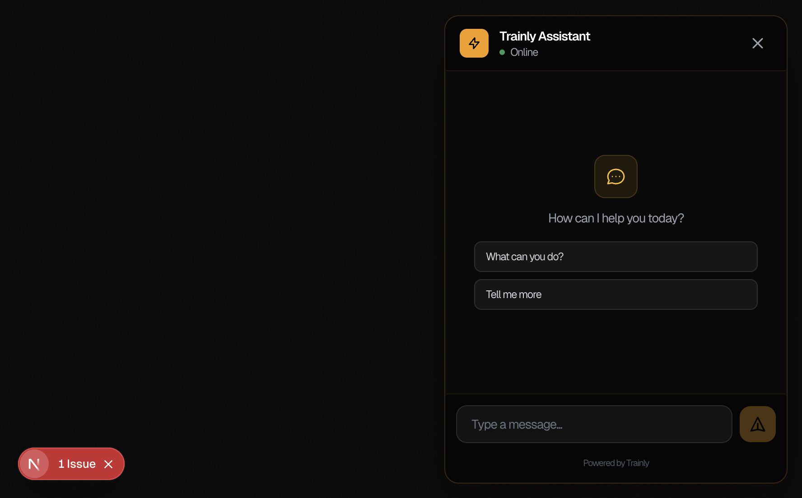

# 🤖 AI Chatbot Template — No-Code Edition

> **Deploy your own AI chatbot in minutes. Zero coding required.**

Built with Next.js 15, Tailwind CSS, and powered by [Trainly AI](https://trainlyai.com).

[](https://vercel.com/new/clone?repository-url=https://github.com/YOUR_USERNAME/YOUR_REPO_NAME&env=TRAINLY_API_KEY,TRAINLY_CHAT_ID,ADMIN_PASSWORD,JWT_SECRET&envDescription=API%20keys%20and%20secrets%20for%20your%20chatbot&envLink=https://github.com/YOUR_USERNAME/YOUR_REPO_NAME%23environment-variables)


<p align="center">
  
</p>

---

## 🛠 Setup Overview (No Coding Required)

You'll:
1. **Make a copy of the project** — Click "Use this template" → "Create repository"
2. **Deploy it to the internet** — Click "Deploy to Vercel" (free tier is fine)
3. **Edit your branding + content** — Use the admin dashboard or edit 2 simple config files
4. **Connect your domain** (optional) — In Vercel, click Settings → Domains

**That's it. No terminal commands. No React knowledge needed.**

---

## ⚡ One-Click Deploy

### Step 1: Create Your Copy

Click the green **"Use this template"** button at the top of this repo, then select **"Create a new repository"**.

### Step 2: Deploy to Vercel

Click the button below (or in your new repo's README):

[](https://vercel.com/new/clone?repository-url=https://github.com/YOUR_USERNAME/YOUR_REPO_NAME&env=TRAINLY_API_KEY,TRAINLY_CHAT_ID,ADMIN_PASSWORD,JWT_SECRET)

Vercel will ask you to fill in these values:

| Variable | What to Enter |
|----------|---------------|
| `TRAINLY_API_KEY` | Your Trainly API key (included with purchase) |
| `TRAINLY_CHAT_ID` | Your Trainly Chat ID (included with purchase) |
| `ADMIN_PASSWORD` | Choose a strong password for admin access |
| `JWT_SECRET` | Run `openssl rand -base64 32` or use any 32+ character random string |

### Step 3: Customize

Once deployed, go to `your-site.vercel.app/admin` and log in with your admin password.

**From the admin dashboard you can:**
- 🎨 **Branding** — Change company name, colors, chatbot name
- 📝 **Content** — Edit headings, descriptions, CTA buttons
- 🤖 **AI Settings** — Adjust system prompt, temperature, model
- 📁 **Knowledge Base** — Upload documents to train the bot
- 🔗 **Embed Code** — Get the script to add to any website

---

## 📝 What You'll Edit (The "No-Code" Part)

Everything your clients need to customize lives in **2 config files**:

### `src/config/branding.ts`
```typescript
export const branding = {
  companyName: 'YOUR AGENCY NAME',
  chatbotName: 'YOUR BOT NAME',
  tagline: 'Your catchy tagline here',
  primaryColor: 'amber',  // amber, blue, green, purple, etc.
  showPoweredBy: false,   // Hide "Powered by Trainly"
  // ...more options
};
```

### `src/config/content.ts`
```typescript
export const content = {
  heroHeading: 'We Build AI Chatbots for Local Businesses',
  heroSubheading: 'Replace missed calls with instant, 24/7 AI assistants.',
  heroCtaText: 'Book a Call',
  heroCtaLink: 'https://calendly.com/your-link',
  // ...more options
};
```

**You don't need to touch anything else:**
- ❌ No `pages/` or `components/`
- ❌ No `api/` routes
- ❌ No `package.json`
- ❌ No React code

Just edit content like you're filling out a form.

**Or even easier:** Use the admin dashboard at `/admin` to edit everything visually!

---

## 🧩 Using This for Multiple Clients

For each new client:
1. **Duplicate your GitHub repo** (or use "Use this template" again)
2. **Change `branding.ts` + `content.ts`** to match the new client
3. **Click "Deploy to Vercel"** again with new API keys
4. **New client, new site, new chatbot** — same system

```
Client #1 → clientone.vercel.app (or clientone.com)
Client #2 → clienttwo.vercel.app (or clienttwo.com)
Client #3 → clientthree.vercel.app (or clientthree.com)
```

Each client gets their own:
- ✅ Deployment & domain
- ✅ Branding & colors
- ✅ Knowledge base (trained on THEIR documents)
- ✅ API keys (data stays separate)

---

## 🎯 What You're Getting

| Component | What It Is | Who It's For |
|-----------|------------|--------------|
| **Landing Page** (`/`) | A demo/showcase page | You (to demo the product) |
| **Chat Widget** | The embeddable chatbot | Your clients' websites |
| **Admin Panel** (`/admin`) | Visual config editor | You (to manage each client) |

### Admin Dashboard Features

| Tab | What You Can Do |
|-----|-----------------|
| 🎨 **Branding** | Company name, colors, chat widget settings |
| 📝 **Content** | Hero text, CTAs, sections, footer |
| 🤖 **AI Settings** | System prompt, temperature, model selection |
| 📁 **Knowledge Base** | Upload PDFs, docs, CSVs to train the bot |
| 🔗 **Embed** | Copy-paste code for client websites |

---

## ✨ Features

| Feature | Description |
|---------|-------------|
| 🎨 **White-Label Ready** | Remove all Trainly branding |
| 💬 **Beautiful Chat Widget** | Modern, responsive — embed anywhere |
| 📦 **One-Line Embed** | `<script src="...">` — works everywhere |
| 🔐 **Secure Admin Panel** | Visual editor for all settings |
| 📄 **Knowledge Base** | Upload PDFs, docs, CSVs to train the bot |
| 🚀 **One-Click Deploy** | No terminal required |

---

## 📦 The Product: Embeddable Widget

**This is what you're selling** — a chat widget that works on any website.

<p align="center">
  
</p>

### How Clients Use It

You give them one line of code:

```html
<script src="https://their-chatbot.vercel.app/widget.js" defer></script>
```

They paste it before `</body>` on their website. Done!

### Works On:
- ✅ WordPress
- ✅ Shopify
- ✅ Webflow
- ✅ Wix
- ✅ Squarespace
- ✅ Any HTML website

---

## 🔒 Security & Privacy

### Your API Key is Safe

> **Your Trainly API key is stored securely on the server and is never exposed to the browser.**

All AI requests are made server-side through Next.js API routes.

### How It Works

- ✅ **Server-side API calls** — API key never sent to browser
- ✅ **httpOnly cookies** — Session tokens can't be stolen via JavaScript
- ✅ **JWT signing** — Cryptographically signed with HS256
- ✅ **Middleware protection** — Admin routes require authentication

---

## 📁 Project Structure

```
├── src/
│   ├── config/
│   │   ├── branding.ts    # ⭐ EDIT THIS: Colors, names, chat settings
│   │   └── content.ts     # ⭐ EDIT THIS: Landing page text & sections
│   ├── app/
│   │   ├── page.tsx       # Landing page (uses your config)
│   │   ├── admin/         # Admin dashboard
│   │   └── embed/         # Widget for embedding
│   └── components/
│       └── ChatWidget.tsx # The chat widget
├── public/
│   └── widget.js          # Embeddable script
└── env.template           # Environment template
```

---

## 🌍 Environment Variables

| Variable | Required | Description |
|----------|----------|-------------|
| `TRAINLY_API_KEY` | ✅ | Trainly API key (included with purchase) |
| `TRAINLY_CHAT_ID` | ✅ | Trainly Chat ID (included with purchase) |
| `ADMIN_PASSWORD` | ✅ | Admin panel password |
| `JWT_SECRET` | ✅ | At least 32 characters |

---

## 💰 Pricing Your Service

### Suggested Pricing

| Service | Price |
|---------|-------|
| Setup Fee | $500 - $2,000 |
| Monthly Retainer | $200 - $500/month |
| Document Training | $100 - $300/hour |
| Custom Features | $150/hour |

---

## 🛠️ Troubleshooting

### Chat not responding
1. Check API keys in Vercel environment variables
2. Verify Trainly dashboard shows the chatbot as active
3. Check browser console for errors

### Admin login not working
1. Ensure `JWT_SECRET` is 32+ characters
2. Clear cookies and retry
3. Check `ADMIN_PASSWORD` matches

### Widget not appearing on client's site
1. Check embed code has correct domain
2. Verify `/widget.js` is accessible
3. Check for CSP restrictions on client's site

---

## ❓ FAQ

**Q: Do I need to sign up for Trainly?**
> Not for your first client — API keys are included! For additional clients, sign up at [trainlyai.com](https://trainlyai.com).

**Q: Can I remove "Powered by Trainly"?**
> Yes, uncheck it in the admin dashboard or set `showPoweredBy: false` in `branding.ts`.

**Q: How do I train the bot on client documents?**
> Go to `/admin` → Knowledge Base → Upload files (PDF, TXT, CSV, etc.)

**Q: Is this really no-code?**
> Yes! You can customize everything through the admin dashboard. The config files are there as a backup option.

---

## 📝 Scripts (For Advanced Users)

If you prefer local development:

```bash
npm install      # Install dependencies
npm run dev      # Development server
npm run build    # Production build
npm run start    # Production server
```

---

## 📜 License

You may use this template for **unlimited client projects**.

**You may NOT:**
- Resell the source code as your own template
- Redistribute the template on marketplaces
- Claim the template as your original work

---

## 🔗 Resources

- **Trainly**: [trainlyai.com](https://trainlyai.com)
- **Next.js**: [nextjs.org](https://nextjs.org)
- **Vercel**: [vercel.com](https://vercel.com)

---

<div align="center">

**Built for AI agencies** 🚀

One template. Infinite clients. No coding required.

</div>
